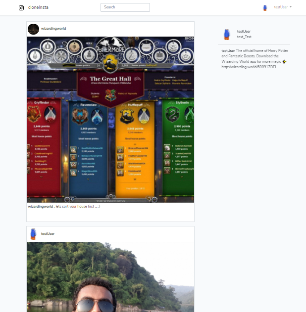
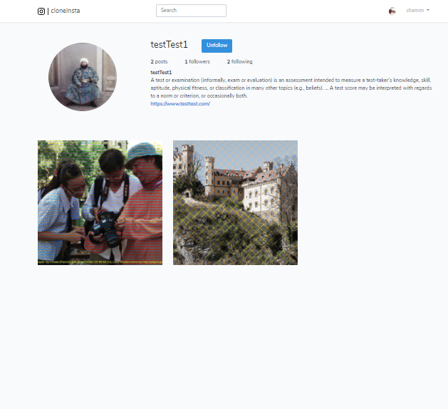
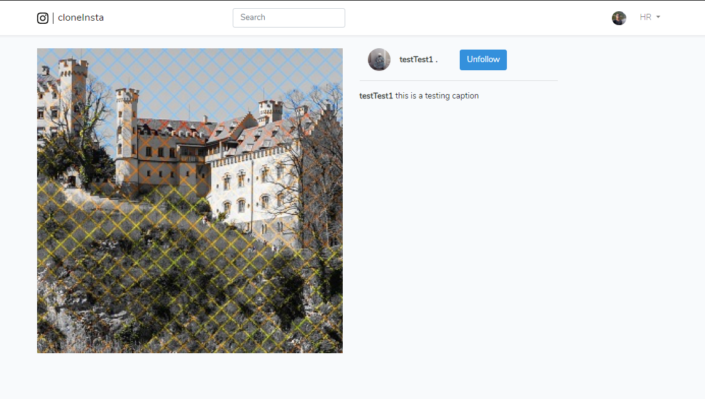

    

# cloneInsta

cloneInsta is an online photo sharing platform which is a clone of the famous social networking platform Instagram. The main intension behind this project was to lear the basics of a web framework, MVC architecture and obviously learning new things is always fun. 

## Features

- Log in/Sign up
- User Authentication
- User Timeline
- User Profile
- Create post
- Follow/Unfollow Users 
- Live Search

## Screenshots

    
    
    
    

### Tools

- **[Laravel 7.26.1](https://laravel.com/)**
- **[PHP 7.3.21 ](https://www.php.net/)**
- **[Vue.js ](https://vuejs.org/)**
- **[HTML, CSS ](https://html.com/)**
- **[BOOTSTRAP 4.5.0 ](https://getbootstrap.com/)**
- **[Sqlite ](https://www.sqlite.org/index.html)**

#### Link : http://copycatinsta.herokuapp.com/login
