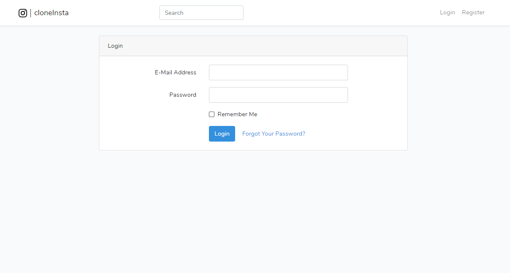
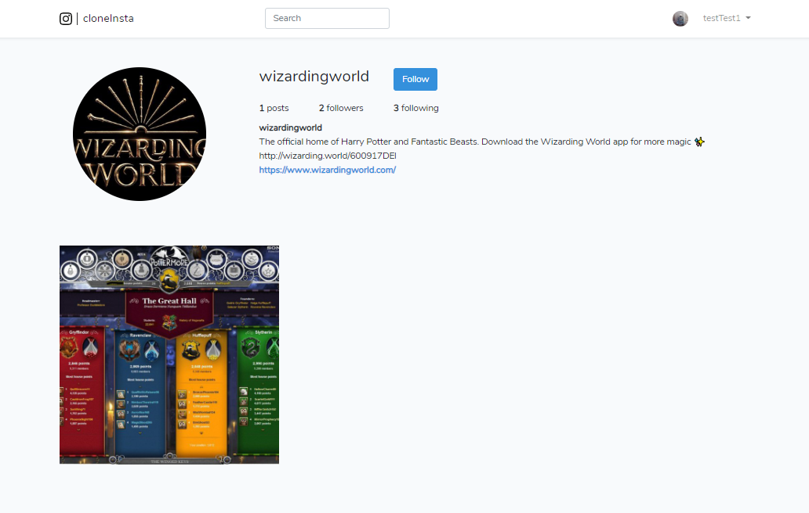
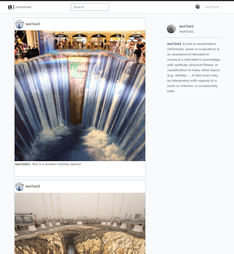
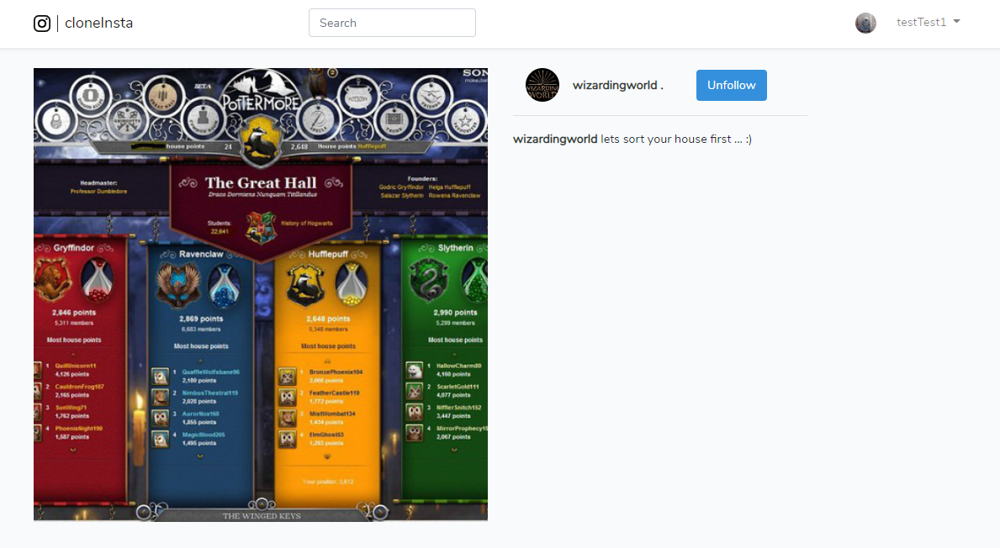

## cloneInsta

cloneInsta is a photo sharing social network platform which is a clone project of Instagram. It is always fun to learn something new and make a clone of an existing system. 

## Features

- User can Log in/Sign up
- User can post a photo with caption
- One user can Follow/Unfollow others
- Live search
- Timeline view of recent activity with paging
- Personal profile 
- Profile information update
- Photo View with caption

## Screenshots

### Tools

- **[Laravel Framework 7.17.1](https://laravel.com/)**
- **[HTML5](https://html.com/)**
- **[BOOTSTRAP 4](https://getbootstrap.com/)**
- **[Vue.js](https://vuejs.org/)**
- **[SqLite](https://www.sqlite.org/index.html)**

## License

The Laravel framework is open-sourced software licensed under the [MIT license](https://opensource.org/licenses/MIT).
